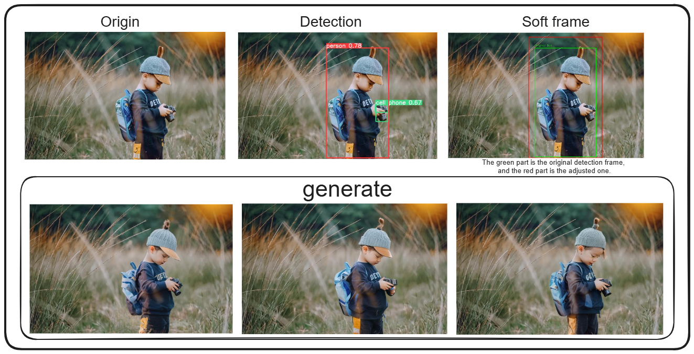
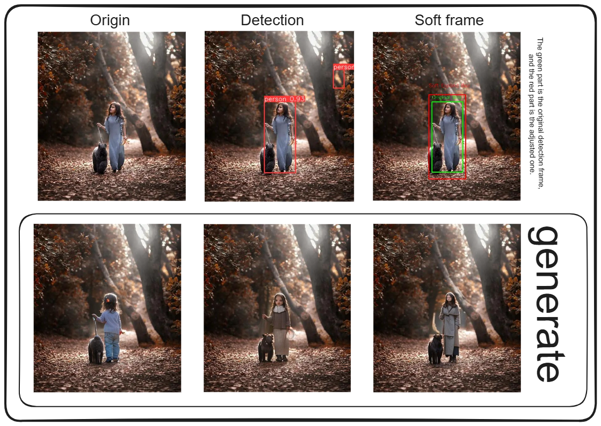
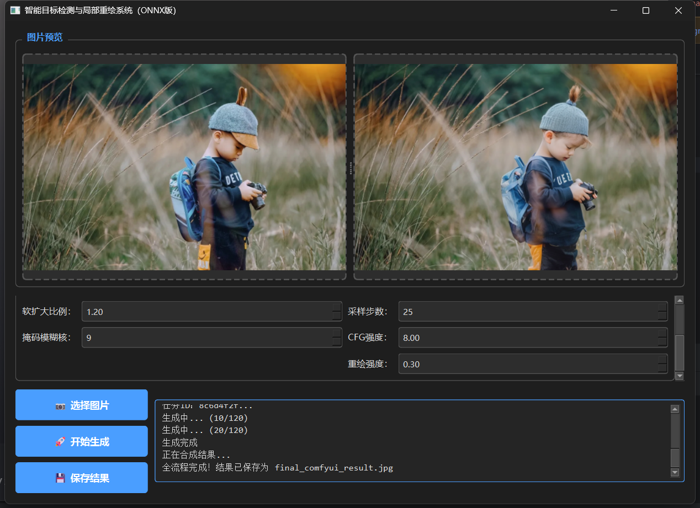

# Intelligent target detection local image redrawing system based on YOLO-ONNX and ComfyUI

# 基于 YOLO-ONNX 与 ComfyUI 的智能目标检测局部图像重绘系统

**一款轻量化、可视化、全自动的 AI 局部图像编辑工具**，支持目标自动检测 → 软掩码生成 → 图像局部重绘 → 结果一键导出  


---

## 一、项目简介
本项目基于 **YOLOv8 ONNX 轻量化模型** 实现目标自动检测，通过 **ComfyUI API** 调用 Stable Diffusion 完成图像局部重绘，搭配 **PySide6 现代化暗色图形界面**，实现无需手动框选、无需复杂操作的智能图像编辑。

解决传统图像编辑：
- 手动框选目标效率低
- 重绘边缘生硬、拼接痕迹明显
- 工具流程复杂、门槛高
- 模型体积大、部署繁琐

**This is an example of a child thinking in front of a camera.**



**This is a little girl walking with a dog in the autumn forest.**




---

## 二、核心功能
1. **ONNX 轻量化推理**  

   使用 YOLOv8 ONNX 模型，无需 PyTorch 训练环境，速度快、体积小、跨平台兼容。

2. **全自动目标检测**  

   自动识别图片中目标，输出原始检测框 + 软扩大检测框，避免目标截断。

3. **软边缘掩码生成**  

   高斯模糊羽化边缘，重绘区域与原图无缝融合，无硬拼接痕迹。

4. **保留原图尺寸**  

   生成结果与输入图像分辨率完全一致，无缩放、无变形。

5. **PySide6 暗色 UI**  

   美观简洁、操作简单，支持实时日志、图片预览、参数可调。

6. **多线程后台运行**  

   生成过程界面不卡顿，支持中断、重试、结果保存。

7. **参数可视化调节**  

   提示词、重绘强度、采样步数、掩码模糊度等全部支持界面调节。

---

## 三、界面特点
- 双图实时预览：左侧原图、右侧生成结果
- 暗色护眼主题，高对比度按钮与控件
- 实时运行日志输出，便于调试与观察状态
- 一键选择图片 → 一键生成 → 一键保存结果
- 自适应布局，不溢出屏幕、适配主流显示器



---

## 四、环境准备
### 1. Python 版本
`Python 3.8 ~ 3.11`

### 2. 安装依赖
```bash
pip install -r requirements.txt
```

如无 `requirements.txt`，直接执行：
```bash
pip install PySide6 opencv-python ultralytics requests pillow numpy onnxruntime
```

### 3. GPU 加速（可选）
```bash
pip install onnxruntime-gpu
```

### 4. ComfyUI 环境
- 本地安装并启动 **ComfyUI**
- 放入写实大模型：`majicMIX_realistic_v7.safetensors`
- 确保 ComfyUI 地址：`http://127.0.0.1:8188` 可访问

---

## 五、快速开始
### 1. 放置模型
在项目根目录创建 `weights` 文件夹，放入你的 ONNX 模型：
```
weights/best.onnx
```

### 2. 启动 ComfyUI
无论你下载的是原版的ComfyUI还是下载的整合包，都可以直接启动，并且保证ComfyUI中存放至少一个模型文件。

### 3. 运行程序

如果你需要直接使用ui界面，则可以直接运行：

```bash
python app.py
```

如果你只是想体验一下，则可以运行：

```bash
python infer_gen.py
```

### 4. 使用步骤
1. 点击 **【选择图片】** 上传需要编辑的图像
2. 调整提示词、重绘强度、软扩大比例等参数
3. 点击 **【开始生成】**
4. 等待检测 + 重绘完成，右侧预览结果
5. 点击 **【保存结果】** 导出最终图像

---

## 六、项目结构
```
Controllable-image-generation/  # 可控图像生成项目根目录
├── assets/                      # 静态资源目录
├── detection/                   # 目标检测模块（YOLO目标检测，用于定位人物区域）
│   ├── runs/                    # YOLO训练/推理结果目录
│   │   └── detect/              # 检测任务结果子目录
│   │       └── train/           # 训练任务专属目录（存放训练日志、检查点等）
│   ├── detection_result.jpg     # 目标检测结果可视化图（展示检测框）
│   ├── girl.jpg                 # 测试图片（用于检测/生成调试）
│   ├── infer.py                 # YOLO检测推理脚本（加载模型，输出检测框）
│   ├── to_onnx.py               # YOLO模型转ONNX格式脚本（轻量化部署）
│   └── train.py                 # YOLO模型训练脚本（自定义数据集训练检测模型）
├── temp_comfyui/                # ComfyUI临时文件目录（存放待处理图片、生成的掩码、临时输出）
├── weights/                     # 项目核心权重目录（统一管理YOLO ONNX模型、IP-Adapter等预训练权重）
├── app.py                       # 项目主程序（PySide6可视化界面，整合检测+重绘+生成）
├── infer_gen.py                 # 推理生成脚本（独立调用检测+ComfyUI生成，无UI调试）
├── kid.jpg                      # 测试图片
├── ProjectDocumentation.md      # 项目详细文档（开发流程、调试记录、技术细节）
├── README.md                    # 项目说明文档（快速开始、核心功能、使用方法）
└── requirements.txt             # 项目依赖清单（Python包版本，用于环境搭建）
```

---

## 七、关键参数说明
| 参数名         | 作用                                   | 推荐值  |
|----------------|----------------------------------------|---------|
| 软扩大比例     | 检测框向外平滑扩展，避免截断           | 1.2     |
| 掩码模糊核     | 掩码边缘羽化程度                       | 9       |
| 采样步数       | 图像生成精度，越大越清晰               | 25      |
| CFG 强度       | 提示词遵循程度                         | 8.0     |
| 重绘强度       | 局部修改力度，0.7 更自然               | 0.7     |

---

## 八、常见问题
### 1. ComfyUI 连接失败
- 检查 ComfyUI 是否启动
- 确认地址：`http://127.0.0.1:8188` 可正常打开

### 2. 找不到 ONNX 模型
- 将 `best.onnx` 放入 `weights/` 目录
- 检查代码中模型路径是否为 `weights/best.onnx`

### 3. 生成图像尺寸不匹配
- 程序已自动修复 8 倍对齐问题，无需手动处理

### 4. UI 窗口过大/溢出
- 本版已优化窗口大小为 `1000×700`，自适应绝大多数屏幕

### 5. 推理速度慢
- 安装 `onnxruntime-gpu` 开启 GPU 加速
- 降低采样步数、降低图片分辨率

---

## 九、技术栈
- **目标检测**：YOLOv8 + ONNX 轻量化推理
- **图像生成**：Stable Diffusion + ComfyUI API
- **UI 框架**：PySide6
- **图像处理**：OpenCV、Pillow、NumPy
- **网络请求**：Requests
- **后台异步**：QThread 多线程

---

## 十、使用声明
本项目仅供 **学习、毕业设计、求职项目展示** 使用，请勿用于商业用途。  
如使用他人图像，请注意版权问题。